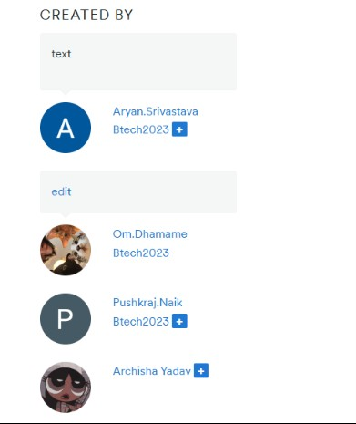
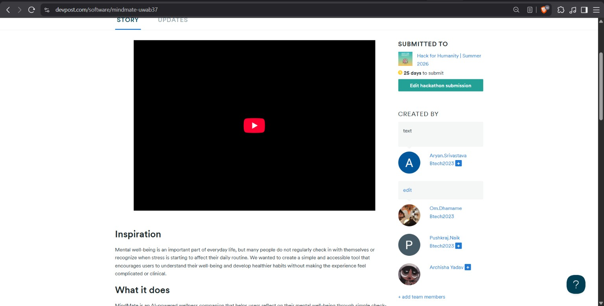

## 👥 Team Information

| S.No | PRN         | Student Name     |
| ---- | ----------- | ---------------- |
| 1    | 23070122041 | Archisha Yadav   |
| 2    | 23070122055 | Aryan Srivastava |
| 3    | 23070122155 | Om Dhamame       |
| 4    | 23070122169 | Pushkraj Naik    |

---

## 🏆 Hackathon

**Nexora Global Hackathon 2026**

🔗 **Hackathon Link:**
https://nexora-global-hackathon.devpost.com

🔗 **Our Hackathon Submission Repository:**
https://github.com/ohmschrodinger/nexera-hackathon

---

## 💡 What We Did

As part of the **Nexora Global Hackathon 2026**, our team worked together to design and develop a technology-driven solution addressing a real-world problem.

We focused on applying modern software development and AI technologies to create a practical, user-friendly solution. The project involved collaborative work across ideation, development, integration, testing, and documentation, culminating in a complete hackathon submission.

# Participation Screenshots:

